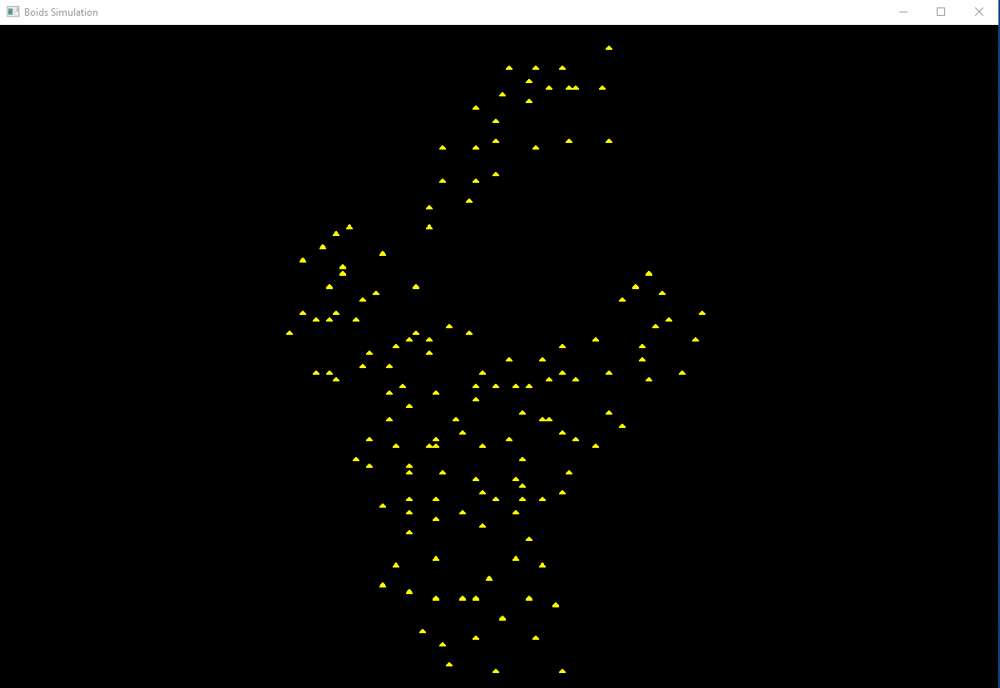

# Simple Boids simulation
This is a simple boids simulation built in Rust. 

It uses [specs](https://docs.rs/specs/0.16.1/specs/), and [RLTK](https://docs.rs/rltk/0.8.1/rltk/).

```sh
git clone https://github.com/Dalot/boids-rust .
cd boids-rust
cargo run
```



